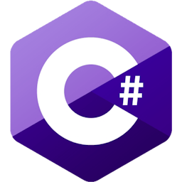
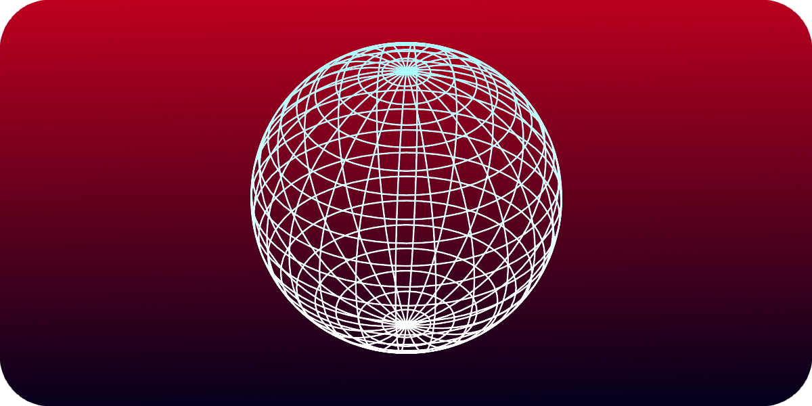

<p align="center" width="100%">
    <h1 align="center"> Introduction  </h1>
</p>

Shape cast detects collision objects within its designated region shape. <br>
It can scan for multiple objects. <br>
This page will focus on two main ways to create and use a shape cast.

<p align="center" width="100%">

</p>

<br>

## First method: ShapeCast3D Node
A node that constantly sweeps a region of space to detect collisions. <br>
With this node its easy to visualize exactly where the sweep region is.

<br>

### Use ShapeCast3D
To begin, create a ShapeCast3D object in your scene. <br>
 <br>
Then add a shape to your ShapeCast3D, <br>
for example, add a box: <br>
 <br>
 <br>

<br>

To check whether the shape cast detected anything we can run this code:
```cs
public override void _Process(double delta)
{
    GD.Print(CollisionResult);
}
```
*CollisionResult* is an [Array](https://learn.microsoft.com/en-us/dotnet/csharp/language-reference/builtin-types/arrays) of [dictionaries](https://learn.microsoft.com/en-us/dotnet/api/system.collections.generic.dictionary-2?view=net-8.0) which contains all the information about the collider the shape cast detected. <br>
For example, the next code prints all of the names of the objects that were detected by the shape cast:
```cs
public override void _Process(double delta)
{
    foreach (Dictionary result in CollisionResult)
    {
        GD.Print(((Node3D)result["collider"]).Name);
    }
}
```

<br>

### Run in _Ready() method
There’s an issue with The ShapeCast3D node, where it won’t detect any colliders if its check runs through a _Ready() method:
```cs
public override void _Ready() // THIS IS BAD CODE DO NOT COPY
{
    foreach (Dictionary result in CollisionResult)
    {
        GD.Print(((Node3D)result["collider"]).Name);
    }
}
```
To fix this, turn _Ready() to an [async](https://learn.microsoft.com/en-us/dotnet/csharp/language-reference/keywords/async) method and wait for 1 frame, like this:
```cs
public async override void _Ready() // THIS IS GOOD CODE, FEEL FREE TO COPY ;)
{
    await ToSignal(GetTree().CreateTimer(0),"timeout");
    
    foreach (Dictionary result in CollisionResult)
    {
        GD.Print(((Node3D)result["collider"]).Name);
    }
}
```
*Note:* To get different information change the “collider” string in result[“collider”].

<br>

### Result

|Type|Information|Description|
|:---|:---|:---|
|Vector3|position|the position where the shapes collided.|
|Vector3|normal|which side the collided object's surface(face) is facing.|
|Object|collider|the object the shape cast detected.|
|ObjectID|collider_id|object's id|
|RID|rid|object's rid.|
|int|shape|object's shape index.|
|Vector3|linear_velocity|object's linear velocity.|

<br>

## Second method: PhysicsShapeQuery
In some cases we would need a more dynamic approach like creating the cast in code. <br>
For example when we want to scan an area dynamically only once. <br>
For this we can use a [PhysicsShapeQueryParameters3D](https://docs.godotengine.org/en/stable/classes/class_physicsshapequeryparameters3d.html). <br>


### 3D Shape
First declare the [Shape3D](https://docs.godotengine.org/en/stable/classes/class_shape3d.html#class-shape3d) that the ShapeCast will use:
```cs
public void Scan_Collisions()
{
    var box = new BoxShape3D();
    box.Size = new Vector3(1,1,1);
}
```

<br>

### 3D Space
Every 3D component in godot is automatically assigned to the World3D class. <br>
Before casting a shape we need to reference this class: <br>
```cs
public void Scan_Collisions()
{
    var box = new BoxShape3D();
    box.Size = new Vector3(1,1,1);

    var spaceState = GetWorld3D().DirectSpaceState;
}
```
*spaceState represents the interactions of objects and their state in our World3D.*

<br>

### Shape Query
To represent the Shape Cast and its properties use [PhysicsShapeQueryParameters3D](https://docs.godotengine.org/en/stable/classes/class_physicsshapequeryparameters3d.html):
```cs
public void Scan_Collisions()
{
    var box = new BoxShape3D();
    box.Size = new Vector3(1,1,1);

    var spaceState = GetWorld3D().DirectSpaceState;
    PhysicsShapeQueryParameters3D query = new PhysicsShapeQueryParameters3D();
}
```
Set the query’s shape:
```cs
public void Scan_Collisions()
{
    var box = new BoxShape3D();
    box.Size = new Vector3(1,1,1);

    var spaceState = GetWorld3D().DirectSpaceState;
    PhysicsShapeQueryParameters3D query = new PhysicsShapeQueryParameters3D();
    query.Shape = box;
}
```
*(Alternatively, instead of creating a shape in code, it is possible to take a shape from a separate node such as CollisionShape3D)*

<br>

### Result
Finally make the query sweep for collisions in our spaceState and print it:
```cs
public void Scan_Collisions()
{
    var box = new BoxShape3D();
    box.Size = new Vector3(1,1,1);

    var spaceState = GetWorld3D().DirectSpaceState;
    PhysicsShapeQueryParameters3D query = new PhysicsShapeQueryParameters3D();
    query.Shape = box;
    var results = spaceState.IntersectShape(query);

    GD.Print(results);
}
```
**Note: the ‘results’ variable is the same as ‘CollisionResult’ from the previous section.**

<br>

### Exclude collision
To make the query ignore a certain collider use the Exclude property. <br>
In this example the query ignores its parent (a RigidBody3D):
```cs
RigidBody3D ignoreThis = GetParent<RigidBody3D>();
query.Exclude = new Godot.Collections.Array<Rid> { ignoreThis.GetRid() };
```
*The exceptions array can contain objects or RIDs.* <br>
*Note: the ‘GetRid()’ method only works in classes that inherit from CharacterBody3D, StaticBody3D and such.* <br>

<br>

### Collision Mask
In some cases using the Exception property could become inconvenient when excluding a lot of objects, <br>
so instead we can use a collision mask. <br>
In this example the query will only detect objects in Layer 1:
```cs
query.CollisionMask = 1;
```

<br>

## Calculate Collision Masks
[More about calculating collision masks and collision layers.](https://000daniel.github.io/Collision-Mask-Layer/) <br>

<br>

## Run in _Ready() method
In a _Ready() method, unlike a ShapeCast3D node that will not detect anything unless it waits 1 frame, this method **will work** and detect colliders:
```cs
public override void _Ready()
{
    var spaceState = GetWorld3D().DirectSpaceState;
    PhysicsShapeQueryParameters3D query = new PhysicsShapeQueryParameters3D();
    query.Shape = new BoxShape3D{Size = new Vector3(1,1,1)};
    var results = spaceState.IntersectShape(query);

    GD.Print(results);
}
```

<br>

### Extra references
[Ray Cast](https://000daniel.github.io/Ray-Cast-Godot/) <br>
[RayCasting Godot](https://docs.godotengine.org/en/4.0/tutorials/physics/ray-casting.html) <br>
[PhysicsDirectSpaceState3D
](https://docs.godotengine.org/en/4.0/classes/class_physicsdirectspacestate3d.html) <br>
[ShapeCast2D](https://docs.godotengine.org/en/4.0/classes/class_shapecast2d.html) <br>
[Physics Introduction](https://docs.godotengine.org/en/4.0/tutorials/physics/physics_introduction.html)
